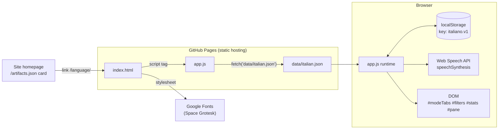
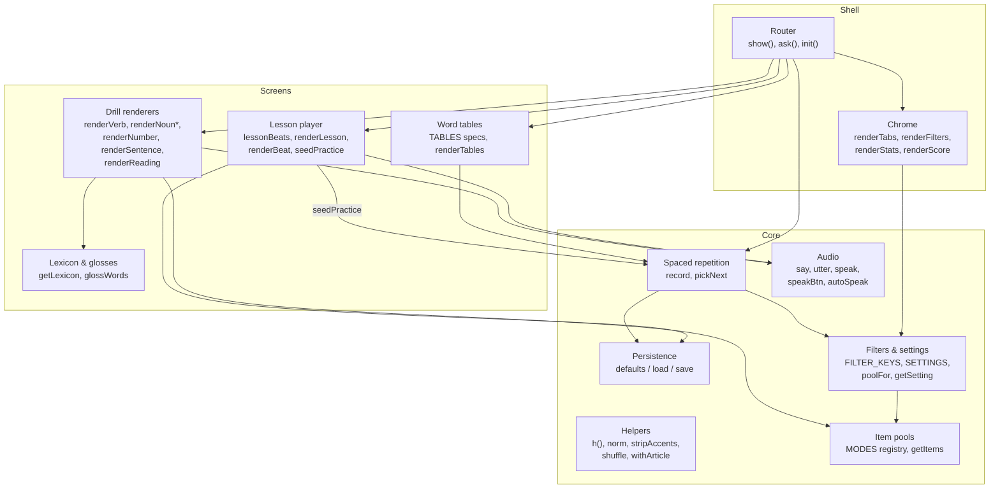
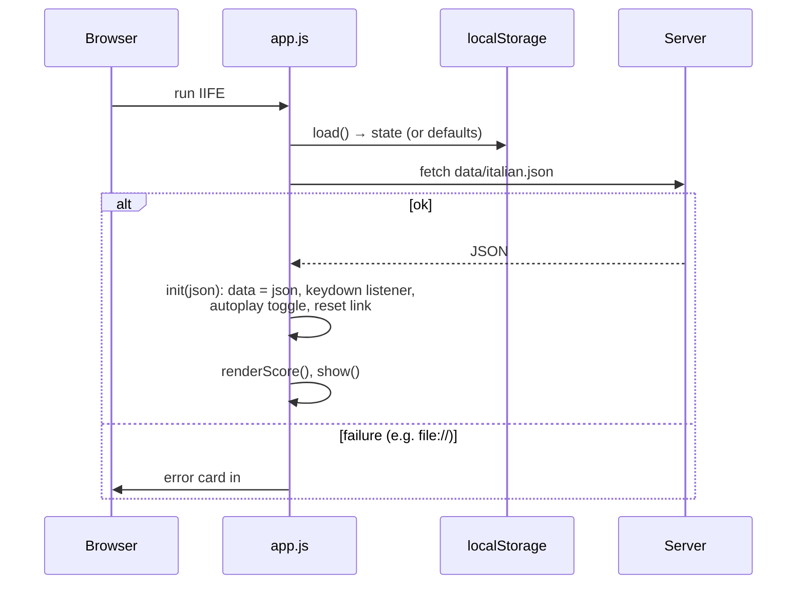
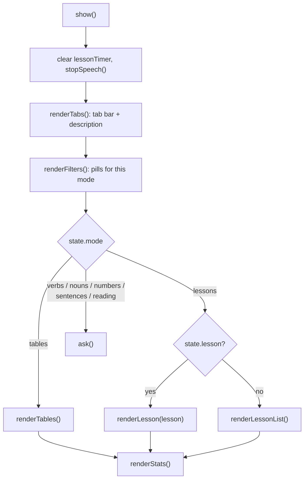
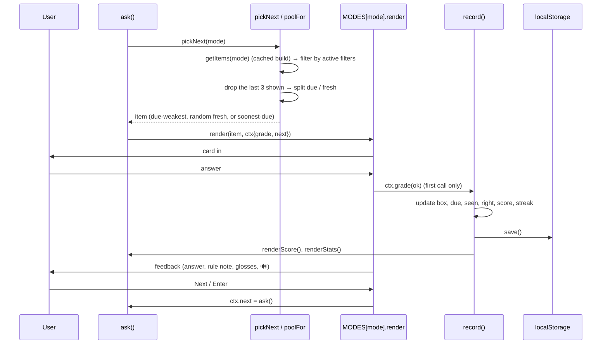
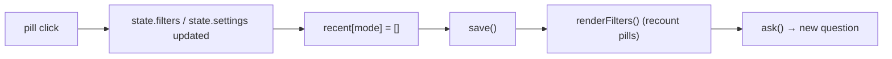
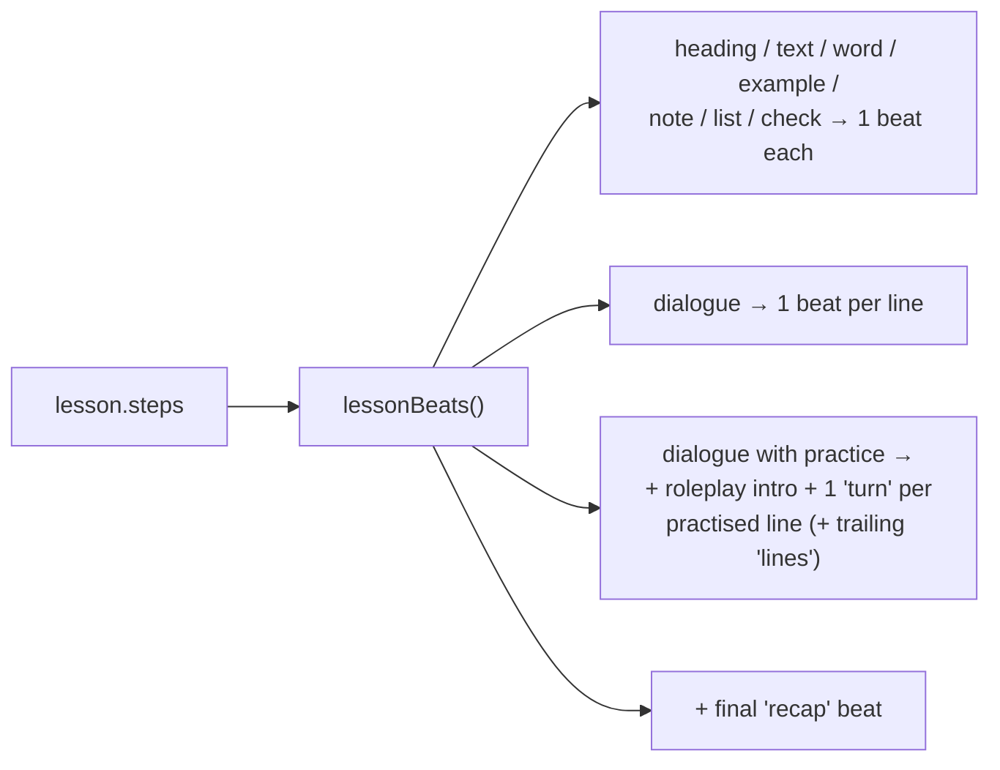
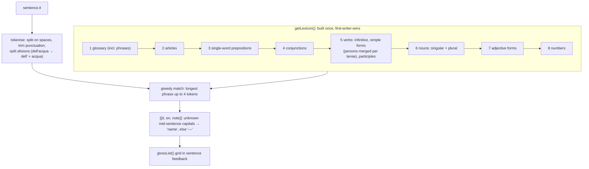
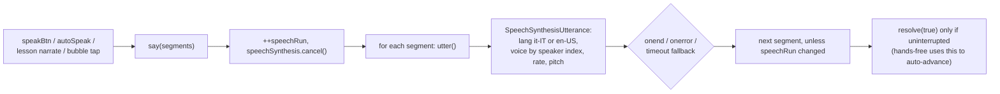
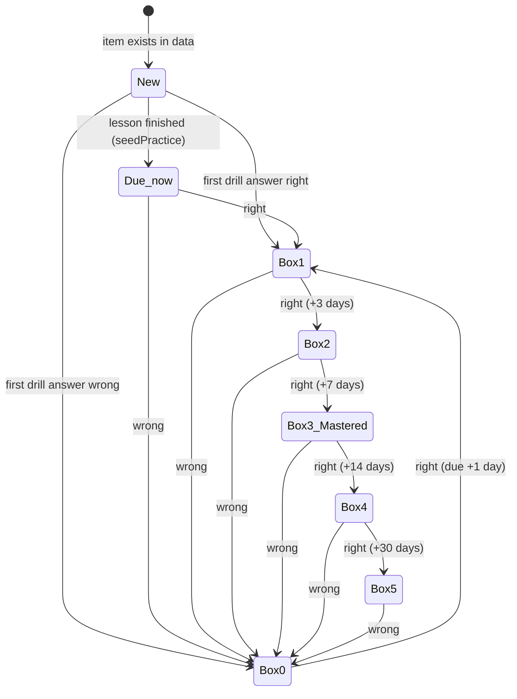

# Italiano Studio — Architecture Map

How the app is put together: what runs where, what data exists, and how control and data move through the code. For the product design (why each feature works the way it does), see [`DESIGN.md`](DESIGN.md). For the lesson curriculum, see [`LESSONS.md`](LESSONS.md).

Line numbers refer to `app.js` at the time of writing. They drift as the file changes, so search for the function name if one is off.

---

## 1. At a glance

Italiano Studio is a **static, client-only web app**. There is no backend, build step, account or network API. Three files do everything:

| File | Size | Role |
|---|---|---|
| `index.html` | ~340 lines | Page shell (header, tab bar, filter area, `#pane`) and all CSS, including light/dark tokens and mobile rules |
| `app.js` | ~1,380 lines | All behaviour, in one IIFE (immediately invoked function) with no imports |
| `data/italian.json` | ~250 KB | All content: vocabulary, sentences, readings, lessons, category labels |

Everything outside those files is a platform service the browser already provides:



| External piece | Used for | If it's missing |
|---|---|---|
| **GitHub Pages** (or any static server) | Serves the three files | The app can't load. Opening `index.html` from disk (`file://`) makes the `fetch` fail, and the app shows a "serve this folder over http" message |
| **Google Fonts** | Space Grotesk typeface | Falls back to system fonts |
| **`localStorage`** | All progress and preferences | Every read and write is wrapped in `try/catch`, so the app works but forgets everything on reload |
| **Web Speech API** (`speechSynthesis`) | 🔊 buttons, auto-play, lesson narration, hands-free | `canSpeak` is false: speak buttons and audio toggles are not rendered at all |
| **Site homepage** (`/artifacts.json`) | The card linking to `/language/` | Only affects discovery |

For local development, run `python3 -m http.server` or `node ../server.js` from the repo root and open `/language/`.

---

## 2. The internal "services"

`app.js` is a single closure, but it's organised into sections that behave like services, each with a clear job and its own slice of state. Top to bottom:



| Service | Where (`app.js`) | Responsibility | Reads | Writes |
|---|---|---|---|---|
| **Constants** | 4–10 | Storage key, Leitner box intervals `[0,1,3,7,14,30]` days, mastery threshold (box 3), recent-item window (3) | — | — |
| **Helpers** | 19–43 | `h()` DOM builder (text via `append`, never `innerHTML`), text normalisation, shuffling, article joining | — | DOM nodes |
| **Persistence** | 45–61 | Load, merge with `defaults()` and save one JSON blob | `localStorage['italiano.v1']` | same |
| **Spaced repetition** | 63–81, 110–141 | `record(id, ok)` moves an item between Leitner boxes. `pickNext(mode)` chooses the next item: weak due items first, otherwise a random new item, otherwise one of the three soonest due | `state.srs`, the filtered pool, `recent` | `state.srs`, score and streak |
| **Filters & settings** | 83–108 | Per-mode filter axes (tense, person, topic, type, function) and non-filtering settings (verb format, noun drill, reading direction) | `state.filters`, `state.settings`, data label lists | — |
| **Item pools** | 142–186 | `MODES` registry: each mode has `label`, `desc`, `build()` (turns data into items with SRS ids) and `render()`. `getItems` caches built pools in `itemCache` | `data.*` | `itemCache` |
| **Audio** | 188–229 | Queue of speech segments (`target` = Italian voice, `en` = English voice), picks voices, cancels on interruption, falls back to a timeout for engines that never fire `onend` | `data.speechLang`, `state.autoplay` | `speechSynthesis` |
| **Shared UI** | 231–242 | Feedback box, Next button, "after answer" key binding | — | DOM, `keyHandler` |
| **Drill renderers** | 244–730 | One renderer per mode. Each builds a card in `#pane`, grades via `ctx.grade(ok)` and advances via `ctx.next` | an item and its data | DOM, `keyHandler` |
| **Lexicon & glosses** | 548–612 | Builds a word → `{en, note}` map once, then glosses a sentence word by word (longest glossary phrase first) | `glossary`, `articles`, `prepositions`, `conjunctions`, `verbs`, `nouns`, `adjectives`, `numbers` | `lexicon` cache |
| **Word tables** | 731–875 | Declarative `TABLES` specs (`head`, `note`, `rows()`) and one generic renderer with search | `data.*`, `state.srs` for status pills | `state.table`, `state.tableTense` |
| **Lesson player** | 877–1240 | Flattens a lesson into beats, reveals one per Next, narrates, runs role-play, resumes, and seeds SRS on completion | `data.lessons`, `data.lessonUnits`, `state.lessons` | `state.lessons`, `state.lesson`, `state.srs` (seeding) |
| **Chrome** | 1242–1309 | Tab bar, mode description, filter and setting pills with counts, New/Learning/Mastered/Due stats, score | `state`, pools | DOM |
| **Router** | 1311–1382 | `show()` draws a screen for `state.mode`. `ask()` runs one drill question. `init()` wires global listeners. The bottom `fetch()` starts the app | everything | everything |

---

## 3. Data

### 3.1 Content: `data/italian.json`

Loaded once at startup into the module-level `data` variable, and never modified at runtime.

| Key | Count | Shape (abridged) | Consumed by |
|---|---|---|---|
| `language`, `name`, `speechLang` | — | `"it"`, `"Italian"`, `"it-IT"` | Audio (voice language) |
| `persons` | 6 | `["io","tu","lui","noi","voi","loro"]` | Verbs, tables, lexicon |
| `personOptions` | 6 | `{id, label, en}` | Person filter, verb prompt gloss |
| `tenseOptions` | 5 | `{id, label, title, description}` | Tense filter, verb feedback, tables, lexicon notes |
| `topics` | 6 | `{id, label}` (everyday, food, directions, bathroom, social, time) | Topic filter (nouns, sentences), tables |
| `sentenceTypes` | 4 | `{id, label}` | Type filter, sentence eyebrow |
| `functions` | 7 | `{id, label, description}` | Function filter, sentence feedback note |
| `verbs` | 30 | `{id, en, rank, auxiliary, participle, irregular, tenses:{tense:{person:form}}, examples}` | Verbs drill (900 items), tables, lexicon |
| `nouns` | 115 | `{id, en, rank, topic, gender, art, plural}` | Nouns drill, tables, lexicon |
| `adjectives` | 20 | `{id, en, rank, forms:{ms,fs,mp,fp}}` | Tables, lexicon (no drill yet) |
| `numbers` | 100 | `{value, it, rank}` | Numbers drill, tables, lexicon |
| `articles` | 14 | `{it, en, type, gender, number, note}` | Articles table, lexicon |
| `prepositions` | 64 | `{it, en, type: simple\|articulated\|phrase, note}` | Prepositions table, lexicon |
| `conjunctions` | 26 | `{it, en, type, note}` | Conjunctions table, lexicon |
| `glossary` | 280 | `{it, en, pos}`: other words and multi-word phrases | Lexicon only (highest priority) |
| `questions` | 16 | sentence fields plus `word`, `answers:[{it,en}]` | Sentences drill, Questions table |
| `sentences` | 214 | `{id, rank, topic, type, function, it, en, accepted}` | Sentences drill, Sentences table |
| `readings` | 14 (46 sentences) | `{id, title, source, license, sentences:[{id,it,en,rank}]}` | Reading drill, Readings table |
| `lessonUnits` | 2 | `{id, title}` | Lesson list headings |
| `lessons` | 16 | `{id, order, unit, title, subtitle, goals, practice, steps}` | Lesson player |

The schema, with examples, is in `DESIGN.md` §4.

### 3.2 Items and SRS ids: the glue

Every drillable thing becomes an **item** with a string id. The same id is used by the drills, the SRS record, the table status pills and lesson `practice` lists, and that's how the parts of the app connect.

| Prefix | Built from | Example | Drill | Items |
|---|---|---|---|---|
| `v:` | `verbs × tenses × persons` | `v:essere:present:io` | Verbs | 900 |
| `n:` | `nouns` | `n:zaino` | Nouns | 115 |
| `#:` | `numbers` | `#:23` | Numbers | 100 |
| `q:` | `questions` | `q:q5` | Sentences | 16 |
| `s:` | `sentences` | `s:s185` | Sentences | 214 |
| `r:` | `readings[].sentences` | `r:colosseo-0` | Reading | 46 |

`PRACTICE_MODE` (line ~881) maps a prefix back to the tab that drills it, which the lesson recap uses for its "Practise in …" buttons. Ids must stay stable: renaming one orphans saved progress.

### 3.3 Persistent state: `localStorage['italiano.v1']`

One JSON object, rewritten in full by `save()` after every change.

```jsonc
{
  "srs": { "<itemId>": { "box": 0-5, "due": 1727400000000, "seen": 3, "right": 2 } },
  "correct": 12, "total": 15, "streak": 4,          // header score
  "mode": "lessons",                                // current tab
  "table": "verbs", "tableTense": "present",        // Word tables sub-tab and tense
  "filters":  { "<mode>": { "<axis>": "<id>|all" } },
  "settings": { "<mode>": { "<key>": "<option>" } },   // format, drill, direction
  "autoplay": false,                                // drill auto-play audio
  "lessons": { "<lessonId>": { "pos": 17, "done": false } },
  "lesson": "al-bar" | null,                        // open lesson, or the list
  "lessonAudio": false, "lessonHandsFree": false, "lessonHideEn": false
}
```

**Reset progress** clears `srs`, the score, `lessons` and `lesson`, and keeps the view and audio preferences.

### 3.4 In-memory state (lost on reload)

| Variable | Holds | Reset by |
|---|---|---|
| `data` | Parsed JSON | — |
| `state` | The persisted object above | `load()` / Reset |
| `itemCache` | Built item pools per mode | never (data doesn't change) |
| `lexicon` | Gloss map | never |
| `recent[mode]` | Last 3 item ids shown, to avoid repeats | Changing a filter or setting |
| `checkOrder` | `WeakMap` from quick-check step to shuffled option order | Page reload |
| `keyHandler` | The current screen's keyboard handler | Every `show()` / `ask()` |
| `speechRun` | Counter that cancels stale speech queues | Every `say()` / `stopSpeech()` |
| `lessonTimer` | Hands-free auto-advance timeout | `show()`, `advance()`, toggles |

---

## 4. How control moves

### 4.1 Boot



A single `keydown` listener on `document` forwards keys to whichever `keyHandler` the current screen set. It ignores modified keys, and it lets a focused button handle Enter itself.

### 4.2 Routing: `show()`

`show()` is the only screen switch. It runs on every tab click, filter change, lesson open or close, and reset.



### 4.3 The drill loop: `ask()` → render → grade → `ask()`

This is the heart of the five drill tabs.



`ctx.grade` is guarded so one question can only be recorded once, even if a renderer calls it twice. Renderers never touch `state.srs` directly.

**Per-mode variations inside `render`:**

| Mode | Renderer | Question forms | Grading |
|---|---|---|---|
| Verbs | `renderVerb` | Choose from 4 (other persons of the same tense) or type (with accent buttons). Picked by the *Format* setting | `checkVerb`: normalised, subject pronoun stripped, `x/y` gender forms accepted, accent-only mistakes accepted with a note |
| Nouns | `renderNoun` → `renderNounArticle` / `renderNounMeaning` | Pick the definite or indefinite article, or pick the noun for an English meaning. Picked by the *Drill* setting | Exact option match |
| Numbers | `renderNumber` | Type the word for a digit, or pick the digit for a word | Normalised; accent-only mistakes accepted with a note |
| Sentences | `renderSentence` | Tap shuffled Italian tiles into order | Normalised join, compared with `it` and `accepted` variants |
| Reading | `renderReading` | Tiles, in either direction (*Direction* setting) | Normalised join against the one target |

Sentence feedback adds `glossList(s.it)`, the word-by-word gloss from the lexicon (§4.6).

### 4.4 Filters and settings



Filter pill counts are computed live: each option counts items matching *all the other* active filters (`matchesFilters(…, skipKey)`), and options with zero matches are disabled.

### 4.5 Lesson playback

A lesson is authored as `steps`. The player turns them into **beats**, one per press of Next.



```mermaid
sequenceDiagram
  participant U as User
  participant RL as renderLesson
  participant RB as renderBeat
  participant A as Audio
  participant ST as state / localStorage
  RL->>ST: read lessons[id].pos
  RL->>RB: replay beats 0..pos (not live: checks shown answered)
  U->>RL: Next / Space / Enter / →
  RL->>RB: reveal(pos+1, live)
  RB-->>RL: {el, speech}
  RL->>ST: setLessonProgress(pos)
  RL->>A: narrate(speech) if Read aloud
  A-->>RL: finished → autoNext() if Hands-free (700 ms)
  Note over RB: check / turn beats set blocked=true;<br/>Next is held until an option is picked (keys 1–9)
  RL->>ST: last beat → done=true, seedPractice(lesson)
  ST->>ST: each practice id not yet seen → srs {box 0, due now}
```

- **Quick checks** are authored with the correct option first. `checkOrder` shuffles the display order once per step per page load, so replays and re-renders keep the same order.
- **Role-play turns** show the real line plus two `wrong` lines (or two random lines from the lesson's dialogues if `wrong` is missing), shuffled.
- **Rich text:** `*asterisks*` in any lesson string become tappable Italian spans (`rich()`), and are split into Italian and English speech segments (`speechOf()`).
- **Nothing in a lesson is graded.** The only thing a lesson writes to the SRS is `seedPractice` on completion. That hand-off is how lessons feed the drills.

### 4.6 Word glosses (lexicon)



Because the first writer wins, a glossary entry overrides a generated form. For example, the phrase *il letto* ("the bed") stops *letto* being glossed as the participle of *leggere*.

### 4.7 Word tables

`renderTables()` picks `TABLES[state.table]`, calls its `rows()` to get `{search, cells}` rows, and renders a table with a search box. The search is case- and accent-insensitive over each row's `search` string. Cells can carry a 🔊 button (`it()` helper) or a status pill (`statusCell(id)`, which reads `state.srs`). Tables only read. The only state they write is the chosen sub-tab and verb tense.

### 4.8 Audio pipeline



`show()` always calls `stopSpeech()`, so switching screens silences everything.

---

## 5. How data changes over a learner's session



Status labels shown in the tables and stats bar: **New** = no record, **Learning** = box 0–2, **Mastered** = box ≥ 3, **Due** = `due ≤ now`.

---

## 6. Extension points

| To add… | Touch | Notes |
|---|---|---|
| **Vocabulary / sentences** | `data/italian.json` only | Append with new ids. Add any new word or phrase to `glossary` so sentence glosses show no "—" |
| **A lesson** | `data/italian.json` → `lessons` (+ `lessonUnits` for a new unit) | Every `practice` id must exist. Each role-played line needs two `wrong` lines. Author checks answer-first |
| **A filter axis** | Tag items in data, add the list to `filterList`, add the key to `FILTER_KEYS` / `FILTER_LABEL` | Pills, counts and disabling are automatic |
| **A setting** | `SETTINGS[mode]`, then read it with `getSetting` in the renderer | Persisted automatically |
| **A drill mode** | New `MODES` entry (`label`, `desc`, `build`, `render`), plus an id prefix in `PRACTICE_MODE` if lessons should link to it | The tab, stats, SRS and filters come for free |
| **A reference table** | New `TABLES` entry (`label`, `note`, `head`, `rows`) | The sub-tab and search come for free |
| **Another language** | See [`MULTILANGUAGE.md`](MULTILANGUAGE.md) | Today about 70 lines of `app.js` are Italian-specific (articles, number notes, pronouns, elision, labels). The plan moves them into per-language packs and services |

---

## 7. Constraints and gotchas

- **Must be served over HTTP.** `fetch` does not work from `file://`.
- **One storage blob.** Every `save()` rewrites the whole state, and SRS records are never pruned. That's fine at the current size (roughly 1,400 items at most).
- **Ids are forever.** Item ids, lesson ids and reading sentence ids are persistence keys.
- **`data` is read-only after load.** Pools and the lexicon are cached on first use and never invalidated, which is safe only because content never changes at runtime.
- **Rendering is imperative.** Each screen clears `#pane` and rebuilds it. There's no virtual DOM or diffing, so the only "subscriptions" are explicit calls to `renderStats()`, `renderScore()` and `renderFilters()`.
- **Keyboard ownership.** Exactly one `keyHandler` is active at a time, and each renderer must set its own or clear it.
- **Speech engines vary.** Voice lists load asynchronously (`getVoices()` warm-up in `init`), and some engines never fire `onend`, hence the length-based timeout in `utter()`.
