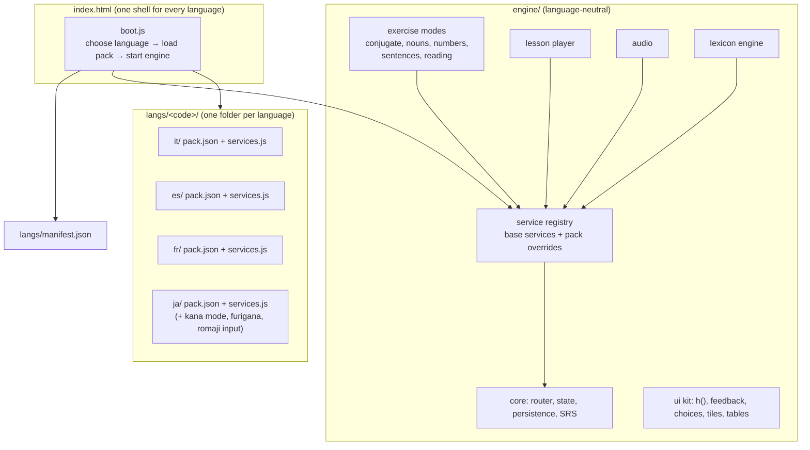
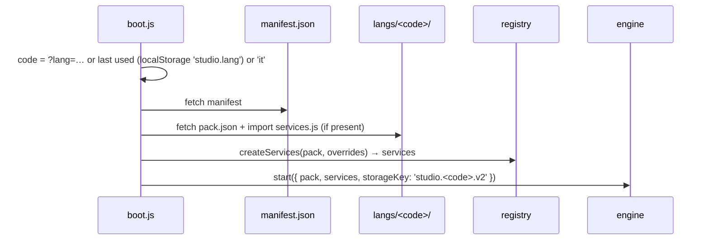

# Multi-language refactor plan

**Goal:** turn Italiano Studio into a generic language-learning engine and add languages as packs: **Spanish**, then **French**, then **Japanese**. The engine owns everything that works the same in every language. Each language pack brings its content (JSON) and, where needed, **language services** (JS) that plug into the engine through fixed interfaces.

**Status:** plan only. Nothing here is implemented yet. For how the current app works, see [`ARCHITECTURE.md`](ARCHITECTURE.md), which this plan refers to throughout.

---

## 1. Where we are

Nearly all *content* is already in data: vocabulary, sentences, readings and all 16 lessons live in `data/italian.json`. The lesson player, spaced repetition, filters, tables framework, tile builder, audio and routing are language-neutral.

About 5% of `app.js` (~70 lines) is Italian-specific, in three tiers:

| Tier | What | Examples |
|---|---|---|
| **1. Strings and config** | Names, labels, paths | `'data/italian.json'`, `STORE_KEY = 'italiano.v1'`, "Italian → English", `ACCENTS`, `PERSON_LABEL`, table headers `io / tu / lui / lei` |
| **2. Grammar as code** | Italian rules written in JS | `DEFINITE`/`INDEFINITE`/`ARTICLE_RULE`, `indefiniteFor`, `pluralArticle`, `withArticle` (elision), `numberNote`, the pronoun regex in `checkVerb`, two-gender assumptions |
| **3. Structural assumptions** | Things that hold for Italian but not for every language | Words are separated by spaces; lowercase the first tile; capitalised word = name; six persons; target text lives in a field called `it` |

Checked against the current code with sample sentences:

| Language | Sentence | What the tile builder does today |
|---|---|---|
| Spanish | `¿Dónde está la estación?` | First tile is `¿Dónde`: the capital and `¿` stay, so the first word is given away |
| French | `Où est la gare ?` | The space before `?` produces an empty tile `''` |
| Japanese | `駅はどこですか？` | The whole sentence is a single tile, and `？` isn't stripped |

---

## 2. Target architecture



**Principles**

1. **The engine never names a language.** No Italian (or Spanish, French, Japanese) word, rule or label appears in `engine/`. Anything that varies goes through a service or comes from `pack.json`.
2. **Data first, code second.** A rule that can be stored explicitly goes in the pack's data, like per-noun articles and number notes. Services exist only for behaviour: tokenising, comparing answers, rendering furigana, converting typed romaji.
3. **Base services with overrides.** The engine ships a *base* implementation of every service that works for a simple space-separated, Latin-script language. A pack's `services.js` overrides only what differs, so Spanish might override three functions and Japanese most of them.
4. **Capabilities, not `if (lang === 'ja')`.** Packs declare `features`, for example no articles, no grammatical gender or a script with readings. The engine shows or hides modes, settings and table columns based on those flags.
5. **Still a static site.** There's no build step. The code uses native ES modules (`<script type="module">` and dynamic `import()`), which GitHub Pages serves as-is.
6. **Italian keeps working at every step.** Every phase ends with Italian behaving exactly as before, and existing saved progress still loading.

### 2.1 File layout

```
language/
  index.html                 shell + CSS (unchanged look)
  boot.js                    picks the language, loads the pack, starts the engine
  engine/
    core.js                  state, persistence, router (show/ask), keyboard
    srs.js                   record, pickNext, statusOf
    filters.js               filter axes + settings framework
    ui.js                    h(), feedback box, choice buttons, tile builder, accent/input bar
    audio.js                 say / utter / speak (language from pack)
    lexicon.js               lexicon engine (sources supplied by services)
    tables.js                table framework + generic tables
    lessons.js               lesson player
    services/base.js         default implementations of every service
    modes/conjugate.js       generic conjugation drill (axes from data)
    modes/nouns.js           article + meaning drills (article drill only if features.articles)
    modes/numbers.js
    modes/sentences.js       tile builder over tokens
    modes/reading.js
  langs/
    manifest.json            [{ code, name, nativeName, path, speechLang }]
    it/pack.json             today's italian.json, migrated to schema v2
    it/services.js           Italian overrides (elision, number notes, subject pronouns)
    es/pack.json, es/services.js
    fr/pack.json, fr/services.js
    ja/pack.json, ja/services.js, ja/kana.js, ja/romaji.js
  tools/
    validate.js              schema + id + gloss-coverage checks for any pack
    smoke.js                 headless run through every mode and lesson (playwright-core)
```

### 2.2 Choosing and loading a language



- **URL:** `/language/?lang=es`. A language picker in the header writes `studio.lang` and reloads. The homepage card keeps linking to `/language/` (Italian by default), and each new language can get its own card linking to `?lang=…`.
- **Progress is per language:** the storage key becomes `studio.<code>.v2`, so the same item ids (`n:casa`, `s:s12`) never collide across languages.
- **Migration:** on first load, if `studio.it.v2` is missing and `italiano.v1` exists, copy it across. The old key stays in place for a release as a fallback.

---

## 3. Language services (the contracts)

`createServices(pack, overrides)` merges each service object, with pack functions replacing base ones, and binds each service to a context:

```js
// Every service function receives this context via `this` or as the first argument
const ctx = { pack, features: pack.features, ui: pack.ui, h, services };
```

The contracts are written as JSDoc typedefs in `engine/services/base.js`, and `tools/validate.js` checks that a pack's overrides only use known names.

### 3.1 `text`: normalising, comparing, tokenising

```ts
interface TextService {
  normalize(s: string): string;                           // case, Unicode form, apostrophes, spacing
  fold(s: string): string;                                // lenient form for "close enough" (accents, kana/katakana)
  compare(guess: string, answers: string[]): { ok: boolean, note?: string }; // exact → ok; fold-equal → ok + note
  tokenize(sentence: string | Token[]): Token[];          // words or segments; strips edge punctuation
  join(tokens: Token[]): string;                          // inverse of tokenize (spaces or none, elision)
  tileText(token: Token, index: number): string;          // what a tile shows (e.g. lower-case the first)
  isName(token: Token, index: number): boolean;           // gloss fallback for proper nouns
  render(text: string): Node | string;                    // e.g. furigana ruby for Japanese
}
type Token = { text: string, reading?: string, lemma?: string };
```

| | Base (Latin, spaces) | Italian | Spanish | French | Japanese |
|---|---|---|---|---|---|
| `normalize` | NFC, lower-case, curly→straight apostrophes | base | base | base + no-break space normalisation | NFKC (full-width → half-width digits), no case |
| `fold` | strip diacritics | base | base (also `ñ`→`n`) | base (also `œ`→`oe`, `ç`→`c`) | katakana→hiragana, long-vowel marks |
| `tokenize` | split on spaces, trim `.,!?` | + split elision (`dell'acqua`) | + trim leading `¿ ¡` | + split elision (`l'`, `j'`, `qu'`…), drop standalone `? ! : ;` and `« »` | **use `tokens` stored in the sentence data** (no spaces to split on) |
| `join` | join with spaces | no space after `'` | base | no space after `'`, space before `? ! : ;` | join with no spaces |
| `tileText` | lower-case the first token | base | base (after `¿`) | base | as written |
| `isName` | capitalised, not first | base | base | base | never (no case) |
| `render` | plain text | base | base | base | `{漢字\|かんじ}` markup → `<ruby>` |

### 3.2 `input`: typing help

```ts
interface InputService {
  helperKeys(): string[];                     // buttons shown under text inputs
  transform?(value: string): string;          // live conversion while typing
  placeholder(kind: 'verb' | 'number' | 'free'): string;
}
```

| Italian | Spanish | French | Japanese |
|---|---|---|---|
| `à è é ì ò ù` | `á é í ó ú ü ñ ¿ ¡` | `é è ê à â ç ô û ù ë ï œ` | none; `transform` converts romaji to hiragana as you type (`taberu` → `たべる`), and answers accept kana or kanji |

### 3.3 `nouns`: gender and articles

Data-first: each noun stores every displayed form, so the service mostly formats.

```ts
interface NounService {
  display(noun, opts: { definite?: boolean, plural?: boolean }): string;  // "la casa", "les maisons", "猫"
  articleQuestion?(noun): { prompt, options: string[], correct: string, rule: string } | null;
  genderLabel(g: string): string;             // from pack.grammar.genders
}
```

Noun schema v2 (every form explicit):

```jsonc
{ "id": "casa", "t": "casa", "en": "house", "topic": "everyday",
  "gender": "f",
  "forms": { "def": "la casa", "indef": "una casa", "defPl": "le case", "pl": "case" } }
// Japanese: no gender, no articles
{ "id": "neko", "t": "猫", "reading": "ねこ", "en": "cat", "topic": "everyday", "counter": "匹" }
```

- The article options and rules move to `pack.grammar.articles`:
  `{ definite: ["il","lo","la","l'"], indefinite: [...], rules: { "lo": "Masculine nouns starting with z…" } }`.
- With `features.articles: false` (Japanese), the Nouns drill offers *Meaning* only, and the Articles table is hidden.
- `features.genders: ["m","f"]` for Italian, Spanish and French. It could also be `["m","f","n"]` or `[]`.

### 3.4 `conjugation`: verbs as tables with axes

The biggest schema change. Today a verb is `tenses × persons`, which is exactly Italian, Spanish and French. Japanese conjugates by **form** (plain/polite × positive/negative × tense, *te*-form…), not by person. So the engine treats a verb as a **table with named axes** that the pack declares:

```jsonc
// Italian, Spanish, French
"conjugation": {
  "axes": [
    { "id": "tense",  "label": "Tense",  "options": [{ "id": "present", "label": "Present" }, …] },
    { "id": "person", "label": "Person", "options": [{ "id": "io", "label": "io", "en": "I" }, …] }
  ],
  "tableRows": "person", "tableCols": "tense",
  "extraColumns": ["auxiliary", "participle"]
}
// Japanese
"conjugation": {
  "axes": [
    { "id": "form", "label": "Form", "options": [
      { "id": "plain",      "label": "Plain",           "en": "eat" },
      { "id": "polite",     "label": "Polite",          "en": "eat (polite)" },
      { "id": "plain-neg",  "label": "Plain negative",  "en": "don't eat" },
      { "id": "polite-neg", "label": "Polite negative", "en": "don't eat (polite)" },
      { "id": "plain-past", "label": "Plain past",      "en": "ate" },
      { "id": "polite-past","label": "Polite past",     "en": "ate (polite)" },
      { "id": "te",         "label": "Te-form",         "en": "eating / and…" } ] }
  ],
  "extraColumns": ["class"]          // ichidan / godan / irregular
}
```

A verb then stores `forms` keyed by the axis values joined with `:`:

```jsonc
{ "id": "mangiare", "t": "mangiare", "en": "to eat", "irregular": false,
  "forms": { "present:io": "mangio", "present:tu": "mangi", … } }
{ "id": "taberu", "t": "食べる", "reading": "たべる", "en": "to eat", "class": "ichidan",
  "forms": { "plain": "食べる", "polite": "食べます", "plain-neg": "食べない", … },
  "readings": { "polite": "たべます", … } }
```

- **SRS ids** stay `v:<verb>:<axis values>`. For Italian that is `v:mangiare:present:io`, exactly as today, so no progress is lost.
- **Filters** are generated from the axes: *Tense* and *Person* for Italian, *Form* for Japanese.
- **Distractors** come from the same verb with one axis changed, generalising today's "other persons of the same tense".

```ts
interface ConjugationService {
  answerVariants(form: string): string[];     // "andato/a" → [andato, andata]  (IT/ES/FR); kana + kanji (JA)
  stripSubject(guess: string, key: string): string;  // drop "io "/"yo "/"je "/"j'" before comparing
  prompt(item): { main: string, sub: string }; // what the card shows
  note?(item): string | null;                  // e.g. passato prossimo agreement
}
```

### 3.5 `numbers`

Stored data: `{ value, t, reading?, note? }`. The Italian `numberNote` becomes a `note` field on each entry (generated once by a tools script), so the service is only needed for things that can't be stored:

```ts
interface NumberService {
  note(value: number): string | null;          // default: the entry's `note`
  display(entry): string;                      // "23" / "ventitré" / "二十三 (にじゅうさん)"
}
```

| Language | Watch out for |
|---|---|
| Spanish | 16–29 are one word (*dieciséis, veintiuno*); 31–99 are three words (*treinta y uno*), so typed answers must allow spaces |
| French | *vingt et un*, *soixante-dix* (70), *quatre-vingts* (80), *quatre-vingt-dix* (90); hyphens in answers |
| Japanese | Kanji plus reading; irregular readings (*よん / し*, *なな / しち*, *さんびゃく*, *ろっぴゃく*); 万 (10,000) grouping for large numbers; answers accept digits, kanji or kana |

### 3.6 `lexicon`: word-by-word glosses

The engine keeps the lookup and the longest-phrase matching. The service supplies the **sources** in priority order and the **tokenizer** from `text`.

```ts
interface LexiconService {
  sources(): Iterable<{ form: string, en: string, note: string }>;  // default: glossary, function words,
                                                                    // verb forms (from axes), nouns, adjectives, numbers
  lookupKey(token: Token): string;             // default: normalize(token.text); JA: token.lemma || token.text
}
```

- Italian, Spanish and French use the default sources over their own data. French adds elided forms (`l'`, `d'`, `qu'`) through its `function words` list.
- **Japanese** sentences store their segmentation, so glosses don't need a tokenizer at runtime:

```jsonc
{ "id": "s1", "t": "駅はどこですか。", "en": "Where is the station?",
  "tokens": [ { "t": "駅", "r": "えき", "g": "station" }, { "t": "は", "g": "topic marker" },
              { "t": "どこ", "g": "where" }, { "t": "です", "g": "is (polite)" }, { "t": "か", "g": "question marker" } ] }
```

Tokens can carry their own gloss (`g`), which beats the lexicon. The sentence builder uses these tokens as tiles.

### 3.7 Pack-contributed modes and tables

Some practice only makes sense for one language. A pack can add modes and tables through the same registries the engine uses:

```js
// langs/ja/services.js
export const modes = {
  kana: { label: 'Kana', desc: 'Read hiragana and katakana.', build: (pack) => …, render: renderKana },
  counters: { label: 'Counters', desc: 'Pick the right counter: 一つ, 一人, 一枚…', build, render },
};
export const tables = { kana: { label: 'Kana', head: […], rows: (pack) => … } };
```

Contributed modes get SRS, filters, stats and "Practise in…" links from the engine. They use their own id prefixes (for example `k:あ`), declared in the pack so the lesson recap can map them.

---

## 4. Pack format (`pack.json`, schema v2)

```jsonc
{
  "schema": 2,
  "code": "es", "name": "Spanish", "nativeName": "Español", "speechLang": "es-ES",
  "ui": {
    "appName": "Estudio de Español",
    "targetName": "Spanish",                       // "Italian → English", "Search Spanish or English…"
    "helperKeys": ["á","é","í","ó","ú","ü","ñ","¿","¡"]
  },
  "features": {
    "articles": true, "genders": ["m","f"], "caseSensitive": false,
    "spaces": true, "script": "latin",             // "latin" | "japanese"
    "formalYou": "usted"                           // shown in lesson tips; purely descriptive
  },
  "grammar": { "articles": { … }, "genders": [{ "id": "m", "label": "masculine", "short": "masc." }, …] },
  "conjugation": { "axes": [ … ] },
  "topics": [ … ], "sentenceTypes": [ … ], "functions": [ … ],
  "verbs": [ … ], "nouns": [ … ], "adjectives": [ … ], "numbers": [ … ],
  "articles": [ … ], "prepositions": [ … ], "conjunctions": [ … ], "glossary": [ … ],
  "sentences": [ … ], "questions": [ … ], "readings": [ … ],
  "lessonUnits": [ … ], "lessons": [ … ]
}
```

**Field rename:** the target-language text field `it` becomes `t` everywhere (`t` = target), with an optional `reading` / `r`. A one-off `tools/migrate-v2.js` rewrites `italian.json` into `langs/it/pack.json`. During the transition, the engine's data accessors read `t ?? it`.

**Tables:** a column whose data is missing, like `auxiliary` for Japanese, is dropped automatically. The "Italian" header comes from `ui.targetName`.

---

## 5. Where today's Italian code goes

| Current (`app.js`) | Moves to |
|---|---|
| `STORE_KEY`, `fetch('data/italian.json')` | `boot.js` (per-language key and path) |
| `ACCENTS` | `pack.ui.helperKeys` → `input.helperKeys()` |
| `PERSON_LABEL`, the verb table's hardcoded headers | `pack.conjugation.axes[person].options[].label` |
| `DEFINITE`, `INDEFINITE`, `ARTICLE_RULE` | `pack.grammar.articles` |
| `indefiniteFor`, `pluralArticle` | Precomputed into each noun's `forms` by `migrate-v2.js`; the functions are deleted |
| `withArticle` (elision) | `langs/it/services.js` → `nouns.display` (only for joining text at authoring time; the runtime reads `forms`) |
| `numberNote` | `note` on each number in the pack (generated once) |
| Pronoun regex in `checkVerb` | `conjugation.stripSubject`, built from the person axis labels |
| `answerVariants` `x/y` parsing | `conjugation.answerVariants`, a base implementation shared by IT, ES and FR |
| Elision split in `glossWords` and first-tile lower-casing | `text.tokenize` / `text.tileText` (base + Italian override) |
| Gender `=== 'm' ? … : …` (5 places) | `nouns.genderLabel` from `pack.grammar.genders` |
| "Italian" in labels, descriptions, placeholders | `pack.ui.targetName` via a small `t()` string helper |

---

## 6. Phases

Each phase is shippable on its own and ends with the Italian regression check (§7).

### Phase 0: Safety net
- Commit `tools/validate.js`: JSON schema, unique ids, every lesson `practice` id exists, two `wrong` lines per role-played line, gloss coverage (no "—" in any sentence).
- Commit `tools/smoke.js`: headless Chrome (`playwright-core` + system Chrome, fake `speechSynthesis`). It answers questions in every mode, plays every lesson to the recap, opens every table, and fails on any page error.
- Capture a **golden snapshot** of Italian: for a fixed random seed, the rendered text of 20 questions per mode, plus every lesson's beat count. Later phases diff against it. This needs a seedable `Math.random` shim, added in the test only.

### Phase 1: Split into ES modules (no behaviour change)
- Break `app.js` into the `engine/` files from §2.1, following the existing section boundaries.
- `index.html` loads `boot.js` as a module.
- Still reads `data/italian.json` and `italiano.v1`, with Italian logic where it is. This is a pure move, checked by the golden snapshot.

### Phase 2: Service registry and the Italian pack
- Add `engine/services/base.js` and `createServices`.
- Move every row of §5 into `pack.json` / `langs/it/services.js`.
- `boot.js`, `manifest.json` (Italian only), per-language storage key with migration from `italiano.v1`.
- **Exit check:** `grep -riE "ital|\\b(io|lui|il|lo)\\b" engine/` finds nothing but comments, and the golden snapshot is unchanged.

### Phase 3: Schema v2
- `tools/migrate-v2.js`: `it` → `t`, noun `forms`, verb `forms` keyed by axes, number `note`s, `features`, `grammar`, `ui`.
- The engine reads v2, and the conjugation drill is driven by `pack.conjugation.axes`.
- The sentence builder works on `text.tokenize()` tokens and compares by joining with `text.join()`.
- **Exit check:** SRS ids are identical before and after (the validator compares the id sets), and the golden snapshot is unchanged.

### Phase 4: Spanish (proves the design on a close language)
- Language services: `text.tokenize` (leading `¿ ¡`), `input.helperKeys`, `conjugation.stripSubject` (`yo, tú, él, ella, usted, nosotros/as, vosotros/as, ellos, ellas, ustedes`).
- Content, mirroring Italian's scope: 30 verbs × 5 tenses (presente, pretérito indefinido, imperfecto, futuro, condicional), ~100 nouns, numbers 1–100, ~150 sentences, Unit 1 lessons.
- Spanish specifics to author: *ser / estar*, *usted*, contractions *al / del*, the extra past tense.
- **Expected engine changes: none.** If Spanish needs an engine edit, the design missed something: fix it in the engine generically, not with a Spanish special case.

### Phase 5: French
- `text`: elision (`l' d' j' m' t' s' n' qu' c'`), non-breaking and normal spaces before `? ! : ;`, `« »`, joining rules.
- `input.helperKeys`, `conjugation.stripSubject` (`je / j'`, `tu`, `il / elle / on`, `nous`, `vous`, `ils / elles`).
- Content: passé composé with *avoir / être* reuses the `auxiliary` / `participle` columns; contractions *au / aux / du / des*; numbers with *et* and hyphens.
- Pronunciation is the main thing French audio can't teach from spelling (liaison, silent letters). That's a later lesson-content concern, not an engine one.

### Phase 6: Japanese (proves the design on a distant language)
- `text`: token-based sentences (stored `tokens`), NFKC normalisation, katakana/hiragana folding for lenient matching, full-width punctuation (`。？！、`), `render()` for furigana (`{漢字|かんじ}` → `<ruby>`) in lessons, bubbles, tiles and tables.
- `input`: romaji → kana `transform` (Hepburn, including `n'`, doubled consonants → `っ`, `shi/chi/tsu`). Typed answers accept kana or kanji.
- `features`: `articles: false`, `genders: []`, `caseSensitive: false`, `spaces: false`, `script: "japanese"`.
- Conjugation by form (§3.4) with verb class (*ichidan / godan / irregular*); adjectives as *i / na* classes (a pack table).
- Pack modes: **Kana** (read hiragana/katakana) and **Counters** (一つ, 一人, 一枚…).
- Politeness (plain vs *desu/masu*) replaces the *tu / Lei* idea in lessons. That's content only; the lesson player needs no change beyond `render()`.
- Audio: `ja-JP` voices. Speak the kanji text (engines read it correctly), and fall back to `reading` when a voice mispronounces a word (a per-token `speak` override in the data).

```mermaid
gantt
  dateFormat X
  axisFormat %s
  section Engine
  P0 Safety net         :p0, 0, 1
  P1 ES modules         :p1, after p0, 2
  P2 Services + IT pack :p2, after p1, 2
  P3 Schema v2          :p3, after p2, 2
  section Languages
  P4 Spanish            :p4, after p3, 3
  P5 French             :p5, after p4, 3
  P6 Japanese           :p6, after p5, 5
```



(Relative sizes only. Content authoring, not code, dominates phases 4–6.)

---

## 7. Testing strategy

| Check | When | Catches |
|---|---|---|
| `tools/validate.js <pack>` | every content or schema change | broken ids, missing distractors, unknown service names, gloss gaps |
| `tools/smoke.js <lang>` | every code change, for every pack | runtime errors in any mode, lesson or table |
| Golden snapshot (Italian) | phases 1–3 | accidental behaviour changes during the refactor |
| Per-service unit fixtures | when a pack adds a service | e.g. French `tokenize("Qu'est-ce que c'est ?")`, Japanese `romaji("kitte")` → `きって` |
| Manual pass on a phone | each new language | input methods, furigana layout, voice quality |

The fixtures live next to each pack (`langs/fr/fixtures.json`: input → expected output per service function) and run under Node without a browser.

---

## 8. Risks and open decisions

| Topic | Risk / question | Proposed answer |
|---|---|---|
| **ES module loading** | Older browsers and `file://` | Already require HTTP; all target browsers support modules |
| **Progress migration** | Losing Italian progress | Copy `italiano.v1` → `studio.it.v2` on first load and keep the old key for one release. The validator proves the SRS id sets are unchanged |
| **Per-language vs shared UI** | Should the interface be translated too? | No. The UI stays English (the learner's language); only `ui.targetName` and helper keys vary. Revisit if non-English speakers become a goal |
| **Japanese typing** | IME vs romaji box | Support both: a phone's Japanese keyboard types kana directly, and the romaji transform is a convenience |
| **Japanese scope** | Kanji is a large, separate skill | Start with kana plus common kanji shown with furigana. A kanji drill would be a later pack mode |
| **Pack size** | Japanese packs with readings and tokens get large | Fine up to a few MB. Readings could split into `langs/<code>/readings.json` later if needed |
| **Schema drift** | Four packs evolving separately | `schema` version in each pack, the validator rejects unknown fields, and migrations live in `tools/` |
| **Speech quality** | Voice availability differs by OS | Keep the current fallback behaviour (no voice → no speak buttons) and note it on the language picker |

---

## 9. Definition of done (per language)

A language is "in" when:
1. `tools/validate.js` and `tools/smoke.js` pass for its pack.
2. Every engine tab works, or is hidden by `features`, with no language-specific code in `engine/`.
3. It has at least Unit 1 lessons, ~100 nouns, ~30 verbs across its conjugation axes, numbers 1–100, and ~150 sentences with full gloss coverage.
4. The manifest lists it, the picker shows it, and progress is stored separately from other languages.
5. The homepage has a card for it (`/artifacts.json`, `?lang=<code>`).
